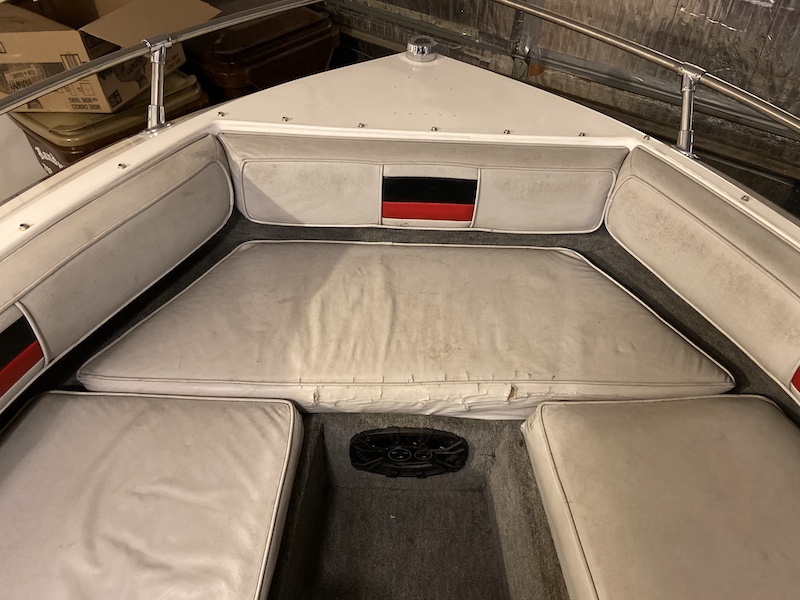
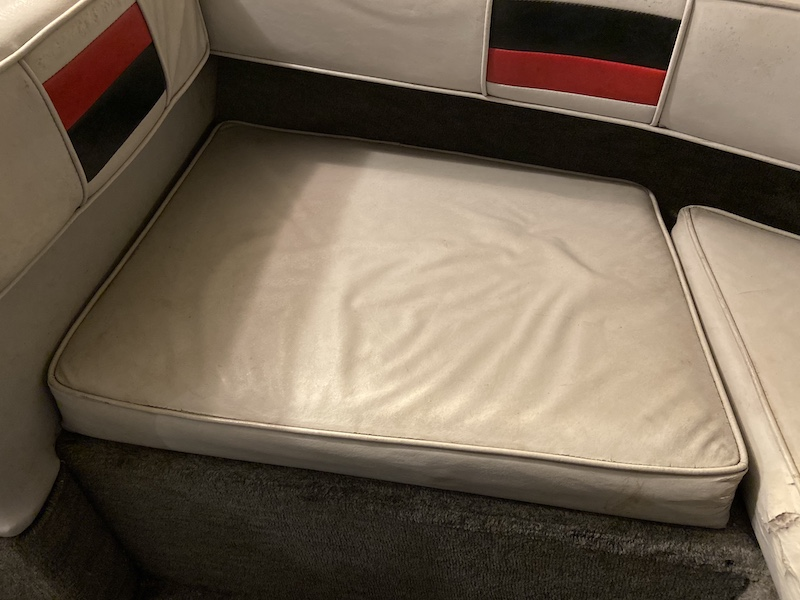
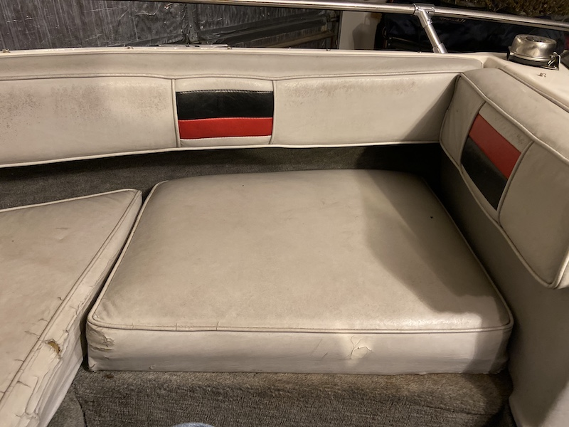
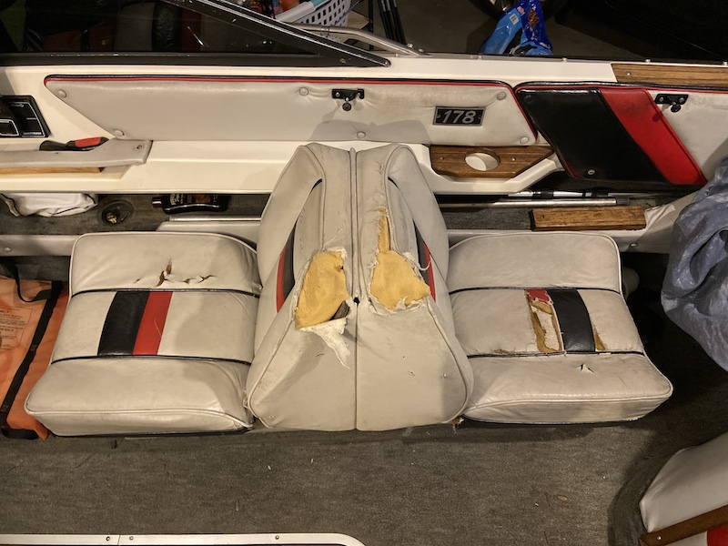
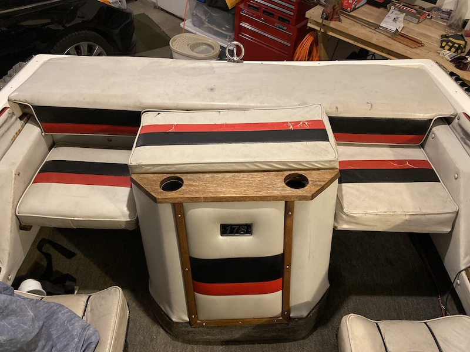

---
---

### Boat interior pictures

All dimensions in inches, from front edge clockwise; generally assuming 4&quot; thickness

#### Bow front

Dimensions: 29.5 x 17 x 47 x 17

Dimensions: 17 x 26 x 22 x 27

Dimensions: 17 x 27 x 22 x 26

---

##### Cabin - combo seats (quantity 2)

Dimensions:

* bottom pad: 17 x 17
* seatback: 17 x 16

---

##### Stern seating and pads

Dimensions:

* rear deck: 69 x 17, with an overhanging lip of 7
* rear seat pads: 16.5 x 16.5
* engine cover pad: 28.25 x 12.5 x 2

